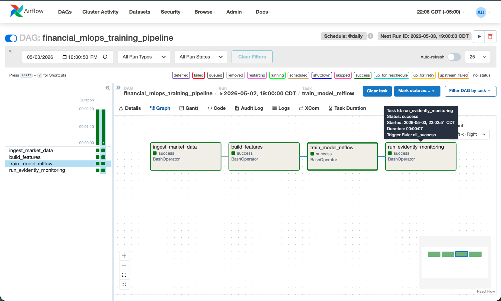
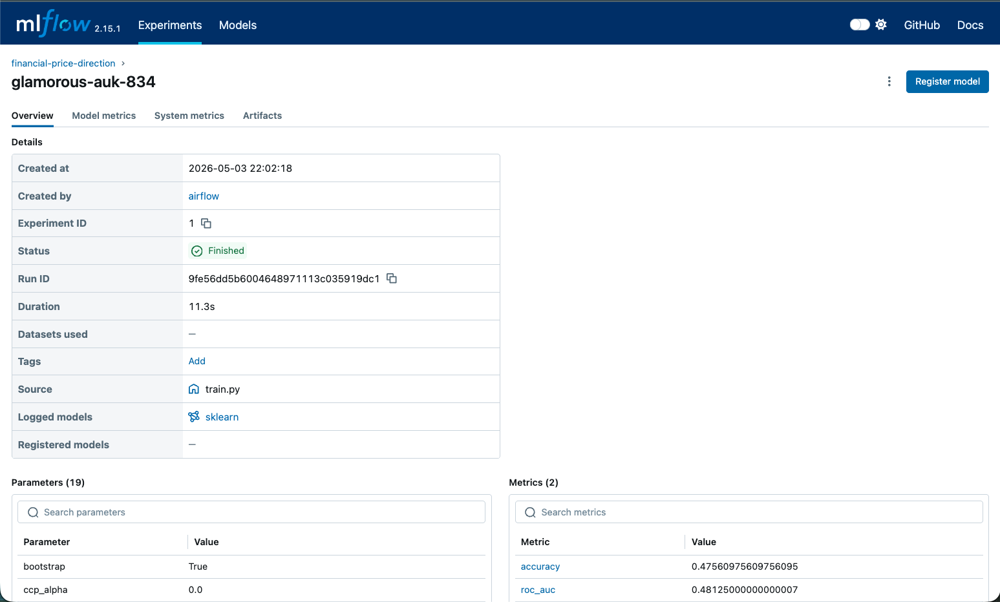
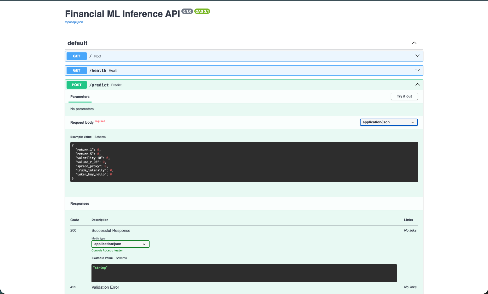
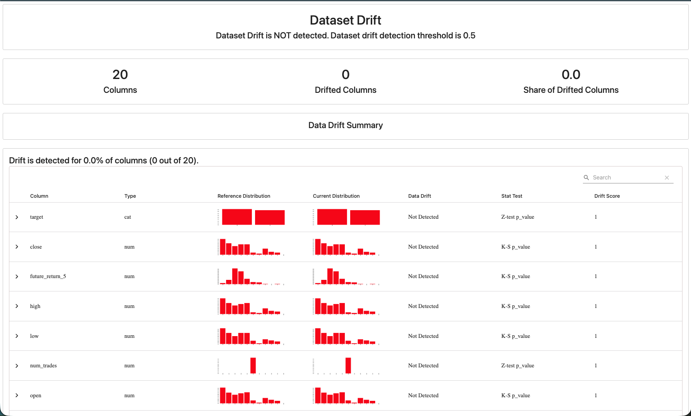
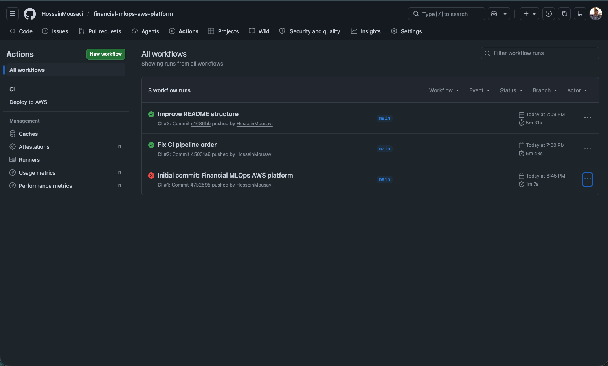
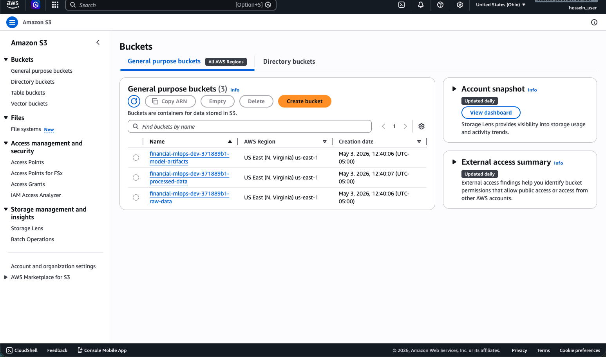
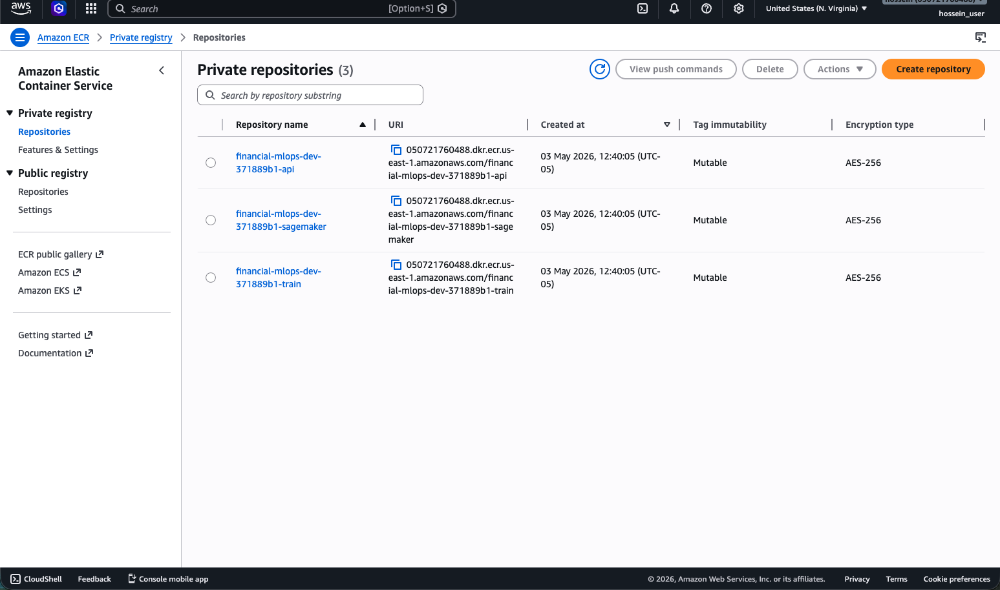
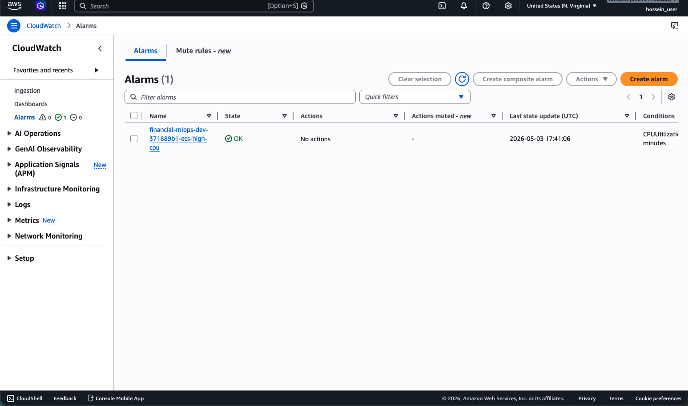

# Financial MLOps AWS Platform

End-to-end MLOps platform for short-horizon financial price movement prediction using crypto market data.

This repo demonstrates:

- AWS infrastructure with Terraform: S3, ECR, ECS, EC2, SageMaker, IAM, CloudWatch
- Dockerized training and FastAPI inference
- Airflow orchestration
- MLflow experiment tracking
- DVC data/model versioning
- Evidently-based drift monitoring
- GitHub Actions CI/CD pipeline setup
- AWS architecture diagram and exact Mac setup commands

## Use case

Predict whether BTCUSDT price will move up over the next short horizon using Binance public market data.

The platform combines:

- real-time financial data
- time-series feature engineering
- production ML deployment
- monitoring and retraining
- cloud infrastructure automation

## Project structure

```text
financial_mlops_aws_platform/
├── infra/terraform/              # AWS infrastructure as code
├── src/                          # ML pipeline source code
├── serving/                      # FastAPI inference app
├── orchestration/airflow/dags/   # Airflow DAG
├── monitoring/                   # Evidently drift monitoring
├── docker/                       # Dockerfiles
├── .github/workflows/            # CI/CD pipelines
├── docs/                         # architecture + step-by-step commands
├── dvc.yaml                      # DVC pipeline
├── docker-compose.local.yml      # local Airflow/MLflow/dev stack
└── Makefile                      # common commands
```

## Screenshots

### Airflow orchestration



### MLflow experiment tracking



### FastAPI inference endpoint



### Evidently drift monitoring



### GitHub Actions CI



### AWS S3 storage buckets



### Amazon ECR repositories



### CloudWatch monitoring alarm




## Start here

Read:

- `docs/STEP_BY_STEP_MAC_COMMANDS.md`
- `docs/AWS_ARCHITECTURE.md`

## Run the Full MLOps Pipeline

### Start all services

```bash
docker compose -f docker-compose.local.yml up --build
```

### Open Airflow

Open:

```text
http://127.0.0.1:8080
```

Login:

```text
username: admin
password: admin
```

### Trigger the training pipeline

In Airflow:

```text
financial_mlops_training_pipeline
```

Trigger the DAG manually.

### Pipeline stages

```text
ingest_market_data
→ build_features
→ train_model_mlflow
→ run_evidently_monitoring
```

### Open MLflow

```text
http://127.0.0.1:5001
```

### Open API docs

```text
http://127.0.0.1:8001/docs
```

### Monitoring report

After pipeline completion:

```text
reports/evidently_monitoring_report.html
```

## Safety

This is an engineering/education project. It does not provide financial advice and should not be used for live trading decisions without risk controls, compliance review, and proper validation.

## AWS Deployment Status

Terraform successfully provisions the core AWS infrastructure:

- S3 buckets for raw, processed, and model artifact storage
- ECR repositories for API, training, and SageMaker images
- IAM roles and policies
- VPC, public subnets, route tables, and internet gateway
- CloudWatch log group and ECS CPU alarm

Docker images pushed to Amazon ECR:

- API image
- Training image
- SageMaker inference image

Cost-control flags are included for optional services:

```hcl
enable_ec2       = false
enable_ecs       = false
enable_sagemaker = false
```