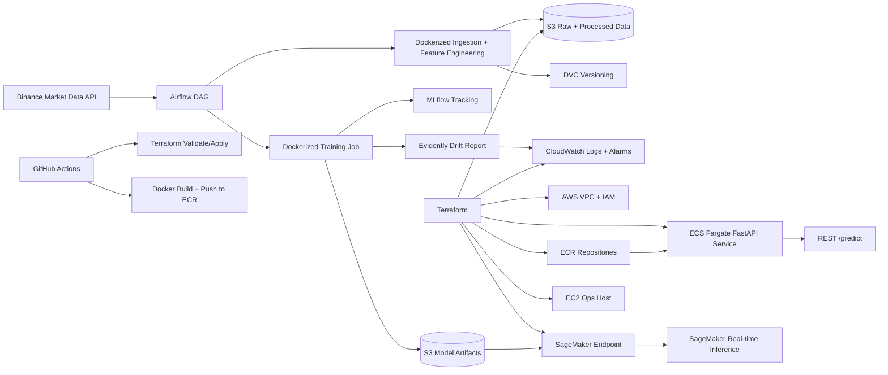

# AWS Architecture

## Components

| Layer | Tool | Purpose |
|---|---|---|
| Infrastructure | Terraform | Reproducible AWS infra provisioning |
| Storage | S3 | Raw data, processed data, model artifacts |
| Container Registry | ECR | Store training and inference Docker images |
| Compute | ECS Fargate | Host FastAPI inference service |
| ML Deployment | SageMaker | Real-time model endpoint pattern |
| Ops Host | EC2 | Lightweight dev/ops server for experiments |
| Orchestration | Airflow | Schedule ingestion, features, training, monitoring |
| Experiment Tracking | MLflow | Params, metrics, model artifacts |
| Versioning | DVC | Data/model pipeline reproducibility |
| Monitoring | Evidently + CloudWatch | Drift reports, logs, alarms |
| CI/CD | GitHub Actions | Build, validate, deploy |

## Notes

This project intentionally includes both ECS and SageMaker:

- ECS shows general containerized production API deployment.
- SageMaker shows ML-native managed endpoint deployment.

In an interview, explain that a real company would usually choose one primary serving path depending on latency, cost, compliance, and team maturity.
